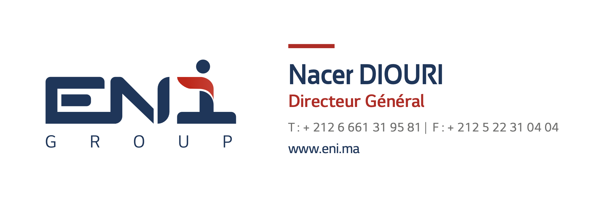

# ✨ Email Signature Generator (Python + Pillow)

This Python script automatically generates personalized email signature images using a base template. It overlays name, job title, email, website, and phone number on top of a design image using custom fonts and colors.

## 📸 Example Output:

Each team member gets a personalized signature image:
```bash
signatures/
├── Nacer_Diouri.png 
├── Youssef_El_Amrani.png
├── Ahmed_El_Idrissi.png
└── Fatima_Zahra_El_Fassi.png
```


## 📚 Project Structure :
```bash
.
├── assets/ # Additional assets
├── fonts/ # Custom fonts
├── template/ # Base image
├── generate_signatures.py # Main Python script
├── requirements.txt # Project dependencies
├── signatures/ # Output folder (auto-created)
└── README.md # Project documentation
```

## 📦 Requirements :
```bash
Python 3.10.10
```

## 🚀 How to run the generator :

1. Clone the repository:
```bash
git clone https://github.com/revo-advertising/eni-email-signature-generator.git && cd eni-email-signature-generator
```
    or download the zip from github : https://github.com/revo-advertising/eni-email-signature-generator/archive/refs/heads/main.zip and extract it

2. install dependencies && run :
    - run in linux and mac OS
    ```bash
        make all
    ```

    - run in windows
    ```bash
        pip install -r requirements.txt
        python generate_signatures.py
    ```
3. After the script completes, you'll find the generated signatures in the `signatures/` folder.

## ⚙️ Customization :
```python
people = [
    {
        "name": "Nacer DIOURI",
        "role": "Directeur Général",
        "phone": "+212 6 00 00 00 00",
        "fax": "+212 5 00 00 00 00",
        "website": "www.eni.ma"
    },
    ...
]
# You can also change:
# - Font paths: in font_bold, font_regular
# - Font sizes and colors: in font_sizes, color
# - Coordinates: in coords
```
